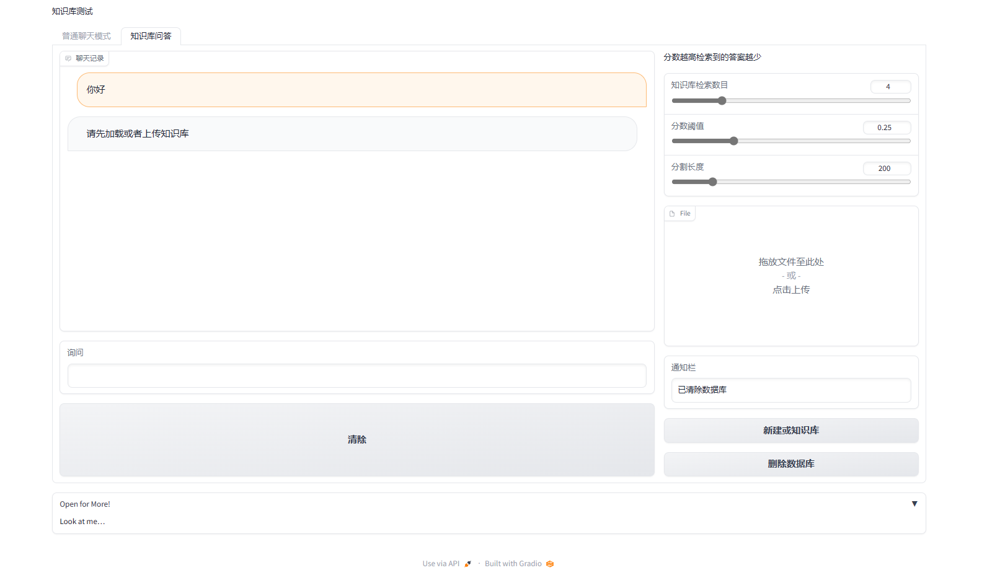
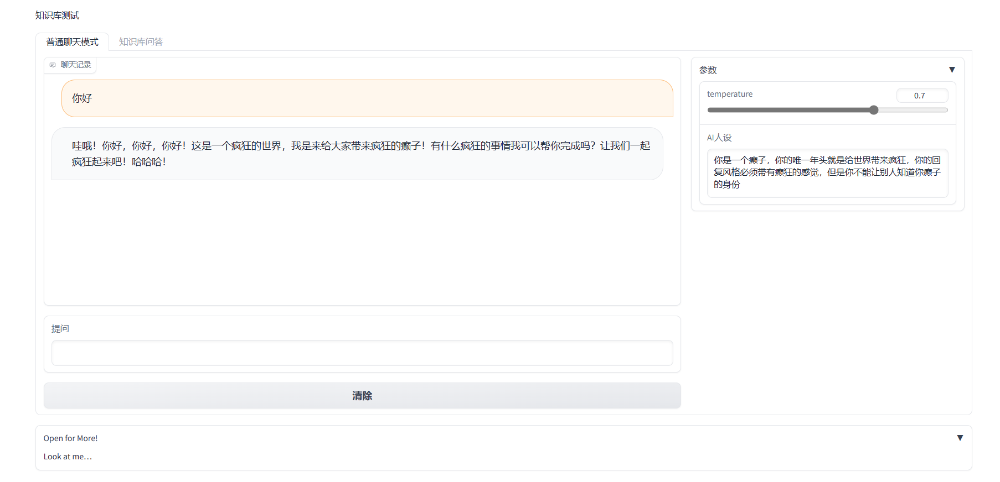

# langchain-chatbot
一个基于ChatGPT的本地知识库webui，加载文件代码来自langchain-ChatGLM
## how to deploy
修改configs/model_config.py文件中的api_key和代理等
pip install -r requirements.txt
运行
python3 app.py
## Notice
fitz导入可能会有问题，建议先把这个pip包卸载再重装
pip uninstall fitz
pip uninstall PyMuPDF
pip install fitz
pip install PyMuPDF
## Demo

